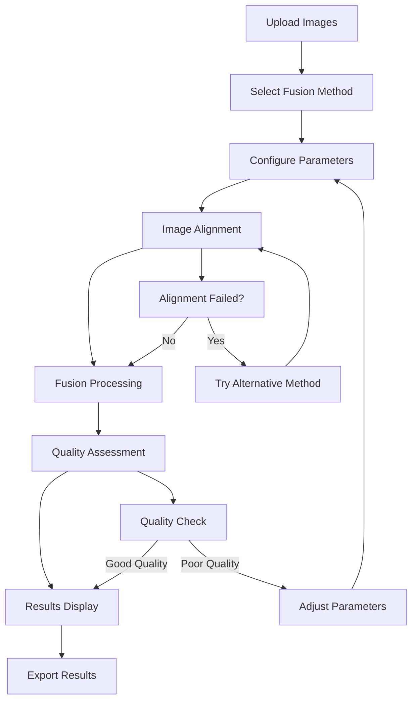

# Product Requirements Document: Bruise Fusion System

## 1. Product Overview

The Bruise Fusion System is an advanced image processing application that combines white-light and ALS (Alternate Light Source) images using spatial-frequency fusion techniques to enhance bruise visibility for forensic and medical analysis. The system provides multiple state-of-the-art fusion algorithms with intelligent image alignment, quality assessment, and an interactive web-based dashboard for real-time processing and visualization.

- **Primary Purpose**: Enable forensic investigators and medical professionals to enhance bruise visibility by fusing complementary imaging modalities
- **Target Market**: Forensic laboratories, medical imaging facilities, research institutions, and law enforcement agencies requiring advanced bruise analysis capabilities

## 2. Core Features

### 2.1 User Roles

| Role | Registration Method | Core Permissions |
|------|---------------------|------------------|
| Forensic Analyst | Direct application access | Full access to all fusion methods, quality metrics, and export capabilities |
| Medical Professional | Direct application access | Access to fusion algorithms, quality assessment, and clinical reporting features |
| Researcher | Direct application access | Complete access including debug modes, algorithm comparison, and batch processing |
| System Administrator | System-level access | Configuration management, method selection, and system monitoring |

### 2.2 Feature Module

Our bruise fusion system consists of the following main components:

1. **Dashboard Interface**: Interactive web-based interface for image upload, parameter configuration, and result visualization
2. **Fusion Processing Engine**: Core algorithms for combining white-light and ALS images using multiple fusion methods
3. **Image Alignment System**: Advanced alignment algorithms to register ALS images with white-light references
4. **Quality Assessment Module**: Comprehensive metrics computation and validation tools
5. **Export and Reporting**: Results export, quality reports, and documentation generation

### 2.3 Page Details

| Page Name | Module Name | Feature Description |
|-----------|-------------|---------------------|
| Dashboard Interface | Main Interface | Upload white-light and ALS images, configure fusion parameters, real-time processing progress |
| Dashboard Interface | Parameter Configuration | Select fusion method (Frequency Domain, Laplacian Pyramid, Wavelet DWT, Gradient-Based, Hybrid Adaptive), adjust method-specific parameters |
| Dashboard Interface | Alignment Settings | Choose alignment method (ORB, SIFT, Multi-Scale, Hybrid), configure alignment parameters, enable ECC refinement |
| Dashboard Interface | Results Display | View fused images, compare original and processed images, display quality metrics (SSIM, PSNR, MSE, NCC) |
| Dashboard Interface | Export Controls | Download fused images, generate quality reports, save processing parameters, export debug information |
| Processing Engine | Fusion Algorithms | Execute frequency domain fusion, laplacian pyramid fusion, wavelet DWT fusion, gradient-based fusion, hybrid adaptive fusion |
| Processing Engine | Image Preprocessing | Resize images, apply CLAHE enhancement, color space conversions, noise reduction |
| Alignment System | Feature Detection | ORB feature detection, SIFT feature detection, multi-scale feature extraction |
| Alignment System | Registration Methods | RANSAC homography estimation, ECC refinement, multi-model motion estimation |
| Quality Assessment | Metrics Computation | Calculate SSIM, PSNR, MSE, RMSE, NCC, mutual information, edge preservation metrics |
| Quality Assessment | Validation Tools | Alignment quality assessment, fusion quality evaluation, comparative analysis |

## 3. Core Process

### Primary User Workflow

1. **Image Upload**: User uploads white-light reference image and corresponding ALS image
2. **Method Selection**: User selects fusion algorithm and alignment method (or uses auto-selection)
3. **Parameter Configuration**: User adjusts method-specific parameters based on image characteristics
4. **Processing Execution**: System performs image alignment, fusion processing, and quality assessment
5. **Results Review**: User examines fused results, quality metrics, and comparative visualizations
6. **Export and Documentation**: User downloads results and generates quality reports

### Advanced Research Workflow

1. **Batch Processing Setup**: Researcher configures multiple image pairs for comparative analysis
2. **Algorithm Comparison**: System executes multiple fusion methods on same image pairs
3. **Quality Analysis**: Comprehensive metrics computation and statistical analysis
4. **Method Optimization**: Parameter tuning and performance evaluation
5. **Research Documentation**: Detailed reports with methodology and results

## 4. User Interface Design

### 4.1 Design Style

- **Primary Colors**: Scientific blue (#2E86AB), Clean white (#FFFFFF)
- **Secondary Colors**: Accent orange (#F24236), Success green (#A23B72), Warning amber (#F18F01)
- **Button Style**: Modern flat design with subtle shadows and hover effects
- **Typography**: Clean sans-serif fonts (Roboto/Inter), 14px base size, 18px headers
- **Layout Style**: Card-based design with sidebar navigation, responsive grid layout
- **Icons**: Scientific and medical-themed icons, consistent outline style

### 4.2 Page Design Overview

| Page Name | Module Name | UI Elements |
|-----------|-------------|-------------|
| Dashboard Interface | Header Section | Application title with scientific icon, navigation breadcrumbs, status indicators |
| Dashboard Interface | Sidebar Controls | Collapsible parameter panels, method selection dropdowns, slider controls for numeric parameters |
| Dashboard Interface | Main Content Area | Drag-and-drop image upload zones, side-by-side image comparison views, progress bars with status text |
| Dashboard Interface | Results Panel | Tabbed interface for different views, zoomable image viewers, metrics dashboard with charts |
| Dashboard Interface | Footer Controls | Export buttons, processing status, help documentation links |

### 4.3 Responsiveness

The application is designed as desktop-first with tablet adaptation. The interface optimizes for large displays to accommodate detailed image analysis while maintaining usability on tablets (minimum 1024px width). Touch interaction is supported for tablet users with appropriate button sizing and gesture controls for image navigation.

## 5. Technical Requirements

### 5.1 Core Technologies

- **Frontend Framework**: Streamlit for rapid development and scientific computing integration
- **Image Processing**: OpenCV, scikit-image, PIL for comprehensive image manipulation
- **Scientific Computing**: NumPy, SciPy for mathematical operations and signal processing
- **Visualization**: Matplotlib, Plotly for charts and image display
- **Quality Metrics**: Custom implementations of SSIM, PSNR, and specialized forensic metrics

### 5.2 Performance Requirements

- **Processing Time**: < 30 seconds for typical image pairs (2-4 MP)
- **Memory Usage**: < 4GB RAM for standard processing
- **Image Support**: JPEG, PNG, TIFF formats up to 12MP resolution
- **Concurrent Users**: Support for 5-10 simultaneous processing sessions

### 5.3 Quality Standards

- **Alignment Accuracy**: Sub-pixel precision with SSIM > 0.85 for successful alignment
- **Fusion Quality**: Maintain or improve edge preservation and contrast enhancement
- **Reproducibility**: Identical results for same input parameters and images
- **Validation**: Comprehensive quality metrics for each processing step

## 6. Success Metrics

### 6.1 Technical Performance Metrics

- **Processing Success Rate**: > 95% successful fusion for typical forensic image pairs
- **Alignment Success Rate**: > 90% successful alignment across different imaging conditions
- **Quality Improvement**: Average 15-25% improvement in bruise visibility metrics
- **Processing Speed**: Average processing time < 20 seconds for 2MP image pairs

### 6.2 User Experience Metrics

- **Ease of Use**: Users can complete basic fusion workflow within 5 minutes
- **Method Selection**: Auto-selection achieves optimal results in > 80% of cases
- **Export Satisfaction**: Generated reports meet forensic documentation standards
- **Learning Curve**: New users achieve proficiency within 2 hours of training

### 6.3 Research and Development Metrics

- **Algorithm Performance**: Comparative analysis shows improvement over baseline methods
- **Publication Impact**: Research applications contribute to peer-reviewed publications
- **Method Innovation**: Continuous improvement in fusion algorithm effectiveness
- **Community Adoption**: Growing user base in forensic and medical imaging communities

## 7. Implementation Phases

### Phase 1: Core Functionality (Completed)
- ✅ Basic fusion algorithms implementation
- ✅ Image alignment system
- ✅ Streamlit dashboard interface
- ✅ Quality metrics computation

### Phase 2: Enhanced Features (Current)
- 🔄 Advanced parameter optimization
- 🔄 Batch processing capabilities
- 🔄 Enhanced export and reporting
- 🔄 Performance optimization

### Phase 3: Advanced Capabilities (Planned)
- 📋 Machine learning-based parameter selection
- 📋 3D-aware alignment methods
- 📋 Real-time processing optimization
- 📋 Cloud deployment capabilities

### Phase 4: Enterprise Features (Future)
- 📋 Multi-user collaboration tools
- 📋 Database integration for case management
- 📋 API development for system integration
- 📋 Advanced analytics and reporting dashboard

## 8. Risk Assessment and Mitigation

### 8.1 Technical Risks

- **Image Quality Variability**: Mitigation through robust preprocessing and multiple alignment methods
- **Processing Performance**: Mitigation through algorithm optimization and hardware scaling
- **Algorithm Accuracy**: Mitigation through comprehensive validation and quality metrics

### 8.2 User Adoption Risks

- **Learning Complexity**: Mitigation through intuitive interface design and comprehensive documentation
- **Integration Challenges**: Mitigation through flexible export formats and API development
- **Validation Requirements**: Mitigation through rigorous testing and forensic standard compliance

## 9. Future Enhancements

### 9.1 Advanced Algorithms
- Deep learning-based fusion methods
- 3D-aware image registration
- Multi-spectral image support
- Automated bruise detection and measurement

### 9.2 Platform Extensions
- Mobile application development
- Cloud-based processing services
- Integration with forensic case management systems
- Real-time collaboration features

### 9.3 Research Applications
- Longitudinal bruise analysis
- Age estimation algorithms
- Pattern recognition for injury classification
- Integration with 3D scanning technologies